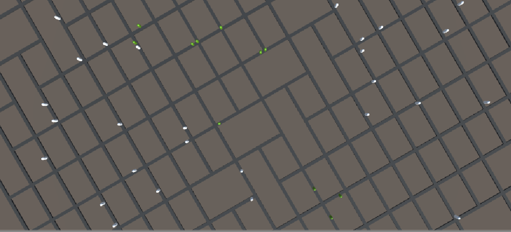

# ComputerScience 30 Final Project - City Escape Game
The general idea of this game is to have a player run around a procedurally generated map and try to escape before the zombies infect and catch them. The zombies have the ability to also infect civilians around them so as time goes on, the map will be harder to escape with more zombies. However due to time constraints and unforeseen issues. The game was modified in an infection simulator in a procedurally generated city.

Environment -
	The game takes place in a procedurally generated city. The city will be made up of multiple grids that would interlock with other grids. Modular buildings would be procedurally placed. As a result, a procedurally generated city would be created.

Player - 
	A controllable camera that allows the player to observe the simulation.

NPC - 
	The city will be populated two different kinds of NPCs. A civilian NPC and a zombie NPC. the civilian NPC would attempt to run from zombies. Zombies will try to convert civilians into zombies and to kill the player.

# Screenshots

# Getting Started / Installing
You will need to have Unity installed beforehand. You are able to install unity from their website.
Download and import the most current version asset package.

# Controls

Up arrow -  move up in the y-axis
Down arrow - move down in the y-axis
Left arrow -  move left in the x-axis
Right arrow -  move right in the x-axis

Space - zoom out
Space + Shift -  zoom in

# Built With
- Unity
- C#

# Credits
- Hasin Zaman
- Rachel Pawliuk

# Project Status
In Progress - Currently on version 1.0

